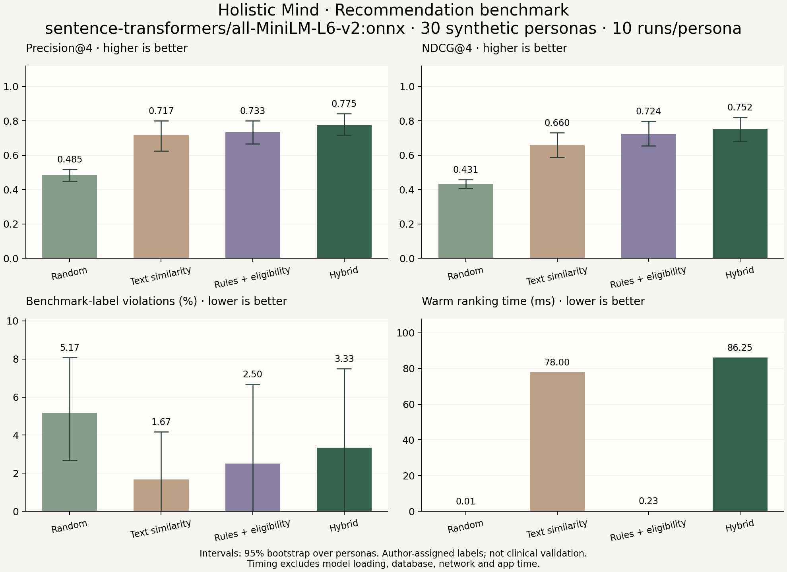

# How the recommendation evaluation works

Reviewed against the original code and saved results on **17 September 2026**.

**18 September update:** new journal-free and explicit-comfort suites now exist.
Read [the new results and case investigation](PRODUCTION-EVALUATION.md) first for
current input behavior. Sections below describing the old saved runs are retained
as historical context; the original reports have not been overwritten.

```bash
npm run benchmark:production
npm run benchmark:comfort
```

These use MiniLM ONNX and write separate JSON, HTML, PNG, and SVG reports. The
production suite is a paired 30-persona journal-free comparison; the comfort suite
is eight declared-preference scenarios using the actual shared TypeScript policy.
Neither is an independently validated clinical or real-user dataset.

**The recommender is promising on this small development benchmark, but it is not yet validated for real-world effectiveness.** The saved MiniLM ONNX hybrid result finds **3.1 relevant exercises out of four**, on average. It improves relevance modestly over rules alone, but still returns exercises marked unsuitable in three scenarios. The benchmark also differs from today's encrypted-journal app, so these scores should not be presented as the current app's accuracy.

## 1. What is being tested?

This is an **offline ranking evaluation**: give several algorithms the same fictional user situations, collect their recommended exercises, and compare those lists with manually authored expected relevance labels. It calls Python ranking functions directly; it does not launch the app, call the backend API, query the database, train MiniLM, or measure whether someone feels better after an exercise.

The test data contains:

- **30 synthetic personas**, including anxious, low-energy, overwhelmed, grounding, and comfort/contraindication scenarios.
- **14 benchmark exercises**, defined locally rather than loaded from the live app catalog.
- **420 manually assigned labels**: every persona has a label for every exercise.
- A request for **four recommendations** per persona.

Each persona supplies a goal, six check-in answers, and fictional journal text. `to_context()` supplies empty interaction, exclusion, and recent-recommendation lists. Consequently this tests the **cold-start** path: recommendations without previous user feedback or recommendation history.

| Label | Meaning within this benchmark |
| --- | --- |
| `3` | Strongest match |
| `2` | Relevant |
| `1` | Weak match; not counted as relevant in precision/recall |
| `0` | Irrelevant |
| `-1` | Marked unsuitable/contraindicated by the benchmark author |

These are authored judgments, not independently validated clinical ground truth. The labels and `clinical_notes` are **not passed into the ranking request**. Labels are used afterward to score the returned IDs. That avoids directly giving the algorithm the answers, but does not make this a held-out or independently assessed dataset.

## 2. The four approaches compared

| Approach | How it chooses exercises |
| --- | --- |
| Random baseline | Shuffles candidates using a reproducible seed and takes four. |
| Text similarity | Compares the current check-in document with exercise descriptions and sorts by embedding similarity. |
| Rules + eligibility | Filters known contraindications, scores rule matches, and sorts by score. |
| Holistic Mind hybrid | Filters known contraindications, combines rules and text similarity, then applies support alignment and category-diversity selection. |

All approaches deduplicate candidates and honor explicit exercise exclusions. Random and text-only deliberately omit suitability filtering. Rules and hybrid enforce known contraindications, including the engine's high-activation/breath-hold constraint. These are comparisons of complete approaches, not a controlled experiment changing exactly one component at a time.

For these cold-start personas, the hybrid's initial score is:

```text
score = 0.72 × rule score
      + 0.23 × current-check-in similarity
      + 0.05 × history similarity
```

The history document includes the goal and synthetic journals. Final selection also considers support alignment and category diversity, so the output is not simply the four highest initial scores. The general engine supports recency penalties and collaborative scoring, but these empty-history personas do not exercise those features. The weights are implementation choices, not percentages of proven contribution to quality.

There are two embedding modes:

- **Lexical:** deterministic hashed word counts. Useful for quick development checks; it is not MiniLM semantic understanding.
- **ONNX:** the actual `sentence-transformers/all-MiniLM-L6-v2` model. This evaluation refuses silent lexical fallback: missing/broken model files stop the run.

## 3. What happens when you run it?

1. Validate unique persona/catalog IDs, complete label coverage, and allowed label values.
2. Select the requested embedding backend and initialize it. Record environment details, source hashes, and ONNX model-file hashes where applicable.
3. Convert every persona into a recommendation context.
4. Warm each context once for each ranker, outside the timing measurements.
5. Run each ranker **10 times per persona** by default: **300 timed calls per model**, or **1,200 across four models**.
6. Check that outputs have no duplicates, unknown IDs, or more than four items. Score each returned list against that persona's labels.
7. Average repeats within each persona, then average the 30 persona scores equally. Coverage instead uses the union of all returned IDs. Latency summarizes all timed calls.
8. Export JSON, an interactive HTML dashboard, and PNG/SVG graphs.

The repeat seed is `base_seed + persona_index × runs_per_persona + run_index`, with base seed `42` by default. Random lists change across repeats. Deterministic rankers generally repeat the same list, which helps measure timing but **does not turn 30 scenarios into 300 independent cases**.

For precision, NDCG, and violations, the evaluator also computes 95% bootstrap intervals: resample the 30 persona means with replacement 2,000 times and take the 2.5th and 97.5th percentiles. These describe variation within this authored dataset, not confidence about all future users.

## 4. What the metrics mean

Here, “relevant” means label **2 or 3**. Most metrics range from 0 to 1; violations and coverage are stored as percentages from 0 to 100.

| Metric | Exact meaning | How to read it |
| --- | --- | --- |
| Precision@4 | Relevant returned items / 4 | Higher means more useful matches among the four slots. Missing slots reduce precision. |
| Recall@4 | Relevant returned items / all relevant items in the persona's 14 labels | Measures how much of the available relevant set was retrieved. Four slots limit achievable recall when more than four items are relevant. Code returns 1 if no relevant labels exist. |
| NDCG@4 | Actual discounted ranking gain / ideal top-four gain | Rewards stronger matches appearing earlier. A score of 1 matches the ideal labeled ranking gain. |
| MRR | Reciprocal rank of the first relevant item, then averaged | First relevant at positions 1, 2, or 3 gives 1, 0.5, or 0.333; no relevant item gives 0. |
| Hit rate@1 | Whether the first recommendation is relevant, averaged | Fraction of cases with a relevant first choice. |
| Hit rate@4 | Whether any of the four is relevant, averaged | A high score does not mean all four are good. |
| Label violation rate | Negative-labeled returned items / returned items × 100, then averaged | Lower is better; target zero. JSON calls this `safety_violation_rate`, but it is not a measured real-world harm rate. |
| Fill rate@4 | Number returned / 4 | Read alongside violations: returning nothing gives zero violations but also zero fill. |
| Intra-list diversity | Fraction of item pairs from different exercise categories | Category variety only; not proof of personalization or usefulness. |
| Catalog coverage | Distinct exercises returned anywhere / 14 × 100 | Breadth across all personas and repeats; not relevance quality. |
| Mean/P50/P95 latency | Warm in-process ranking time in milliseconds | Excludes model loading, database, network, mobile rendering, and user interaction. |

NDCG uses:

```text
DCG@4 = sum over ranks 1..4 of (2^max(label, 0) - 1) / log2(rank + 1)
NDCG@4 = DCG@4 / DCG of the ideal four labels
```

Negative labels receive zero ranking gain, so **NDCG cannot replace the separate violation metric**. Its ideal ranking is derived from all catalog labels, not a separately eligibility-filtered ideal list.

For example, returned labels `[3, 2, 1, -1]` give precision `2/4 = 0.50`, MRR `1`, hit rate@1 and @4 both `1`, fill `1`, and violations `25%`. This illustrates why “at least one good recommendation” can coexist with a problematic list.

## 5. How good are the saved results?

The following figures come from [the saved ONNX JSON](evaluation_results_onnx.json), generated **12 September 2026 (UTC)** with hybrid-v4, 30 personas, 10 repeats, and seed 42. This documentation update did not rerun or replace the benchmark. All six recorded evaluation/engine source hashes still match the files checked on 17 September.

| Approach | Precision@4 | NDCG@4 | Relevant first choice | Label violations | Mean warm time |
| --- | ---: | ---: | ---: | ---: | ---: |
| Random | 48.50% | 0.4315 | 55.00% | 5.17% | 0.009 ms |
| MiniLM text similarity | 71.67% | 0.6602 | 70.00% | 1.67% | 78.001 ms |
| Rules + eligibility | 73.33% | 0.7244 | 90.00% | 2.50% | 0.230 ms |
| Holistic Mind hybrid | **77.50%** | **0.7522** | 86.67% | 3.33% | 86.248 ms |

**My assessment: a useful prototype with a modest relevance improvement, and unresolved suitability gaps.**

- Hybrid averages **3.1 relevant items per four** versus approximately **2.93** for rules and **1.94** for random.
- It improves precision over rules by **4.17 percentage points** and NDCG by **0.0278**. Rules already provide much of the measured quality.
- Hybrid finds at least one relevant item for **all 30 personas**, but its first item is relevant for **26/30**. Rules do better on that first-choice metric: **27/30**.
- Hybrid has **100% fill**, **100% catalog coverage**, recall **0.4920**, MRR **0.9333**, and category diversity **0.7556**. These are separate properties, not one overall accuracy score.
- Its label violations are worse than both rules and ONNX text-only on this dataset. Better average relevance does not resolve that weakness.
- Hybrid precision's bootstrap interval is **71.67–84.17%**; rules' is **66.67–80.00%**. The evaluator does not perform a paired significance test, so it does not establish a reliable population-wide improvement over rules.
- Hybrid P95 warm ranking time is **92.483 ms** on the recorded machine. This is not the time a user waits for a recommendation screen.

The [saved lexical run](evaluation_results.json), generated **13 September 2026 (UTC)**, has hybrid precision **75.83%**, NDCG **0.7574**, violations **3.33%**, and mean warm time **0.797 ms**. ONNX improves precision slightly but not every metric; the different timing reflects different computation. Neither “77.5% accurate” nor “MiniLM improves everything” is a fair summary.

### The three unresolved hybrid scenarios

Both saved embedding modes show these negative-labeled selections:

| Persona | Exercises marked unsuitable but returned | Gap to investigate |
| --- | --- | --- |
| P07: low energy/inertia | `body-scan` | Its negative label lacks a matching contraindication in the exercise metadata. Review the label and metadata decision. |
| P27: touch aversion | `self-containment-hold`, `butterfly-hug` | The concern appears in synthetic journal text, without an explicit comfort signal/exclusion. Similarity is not a reliable contraindication detector. |
| P29: dizziness/head-turn discomfort | `orienting-exercise` | The scenario needs an explicit restriction; journal similarity does not reliably enforce it. |

That is four negative-labeled selections among 120 recommendation slots for one pass through the 30 personas: **3.33% of slots**, affecting **3/30 personas**. Repeating the same deterministic lists does not provide additional independent failure cases. These labels remain visible rather than being changed to make the results look better.

## 6. Why these scores are not the current app's measured quality

The current [backend recommendation route](../../backend/src/routes/recommendations.ts) sends `journal_texts: []` because encrypted journal text and decryption keys stay on the user's devices. **This benchmark still supplies fictional plaintext journals** to the Python engine. Re-running the existing command preserves that mismatch; it does not automatically evaluate the journal-free app configuration.

The app also collects optional comfort preferences for self-touch, breath holds, head/eye scanning, and body scans. The backend maps those preferences to exclusions and signals. The original benchmark personas do not supply those preferences. Separate regression tests check their enforcement; those tests do not update these saved ranking scores or demonstrate that the engine can infer preferences from writing.

Other limits:

- No independently reviewed labels or held-out test set are established here. Developing against the same 30 scenarios can overfit them.
- No real-user helpfulness, completion, symptom improvement, or long-term retention outcomes are measured.
- The benchmark does not measure collaborative recommendations, repeated-use rotation, the full live catalog, or the separate mobile fallback algorithm.
- The comparison changes filtering, input use, and selection as well as scoring. It cannot isolate MiniLM's contribution alone.

To strengthen the evidence, add a **separate production-matched suite** with empty journal texts and explicit comfort preferences, retaining this original suite for comparison. Include neutral preferences, all preferences, and sparse eligible pools. Independently review the disputed labels/metadata, add unseen scenarios, and evaluate relevance alongside zero known-restriction violations. Later, collect consented helpfulness/skip/completion feedback and test repeat-use behavior. These are proposed next steps, not changes made by this README.

## 7. Graphs and interactive exploration

- **[Open the ONNX dashboard](evaluation_results_onnx.html)** for the actual MiniLM results.
- **[Open the lexical dashboard](evaluation_results.html)** for the lightweight development run.
- Exportable ONNX charts: [PNG](evaluation_results_onnx_charts.png) · [SVG](evaluation_results_onnx_charts.svg).
- Exportable lexical charts: [PNG](evaluation_results_charts.png) · [SVG](evaluation_results_charts.svg).

Open the HTML file in a browser; no server, login, or internet is required. Select a metric, filter/search the persona heatmap, and click a cell to inspect a model's ranked exercises and labels. The run selector exposes the exact list and seed for a repeat. Summary metrics average repeats, while the detail panel describes the selected run. JSON/CSV export and print/save-PDF controls are included.

Start with precision and NDCG to compare relevance, then inspect violations and the P07/P27/P29 rows. The static four-panel charts show precision, NDCG, label violations, and warm latency. Error bars on quality metrics show the persona-bootstrap intervals described above.



## 8. Run it yourself

Run these commands **from the project root**, not this folder:

```bash
# Fast lexical evaluation; writes evaluation_results.* and its charts
npm run benchmark

# Actual MiniLM evaluation; writes evaluation_results_onnx.* and its charts
npm run benchmark:onnx

# Custom output keeps the existing standard report intact
npm run benchmark:onnx -- --runs 20 --seed 123 --output /tmp/custom-benchmark.json

# Separate implementation checks (not evidence of recommendation usefulness)
npm run recommender:test
npm run recommender:typecheck
npm run test:comfort
```

Standard commands overwrite their corresponding saved JSON, HTML, PNG, and SVG files. Use `--output` to preserve an earlier comparison. JSON includes all per-run lists, relevance labels, metrics, seeds, summaries, and provenance metadata.

The scripts expect Python 3.12 in `recommender/.venv312`, the development dependencies, and local model files for ONNX. See the [environment setup instructions](../../samyam%20docs/RECOMMENDATION-BENCHMARK.md#local-python-setup). `SENTENCE_TRANSFORMER_PATH` can override the model location. Fixed sources/model files/seeds make quality results reproducible; timing varies by machine and load.

## 9. Where to read the implementation

| File | Responsibility |
| --- | --- |
| [benchmark_personas.py](benchmark_personas.py) | Scenarios, expected labels, and conversion to request contexts. |
| [catalog.py](catalog.py) | The fixed 14-exercise benchmark catalog and metadata. |
| [evaluate.py](evaluate.py) | Four rankers, validation, repeated runs, aggregation, bootstrap intervals, and exports. |
| [metrics.py](metrics.py) | Exact metric formulas and edge cases. |
| [../app/engine.py](../app/engine.py) | Real recommendation filters, scoring, and selection. |
| [report.py](report.py) | Produces the self-contained interactive HTML report. |
| [plot.py](plot.py) | Produces PNG/SVG figures. |
| [../tests/test_evaluation.py](../tests/test_evaluation.py) | Regression checks for evaluation behavior. |

