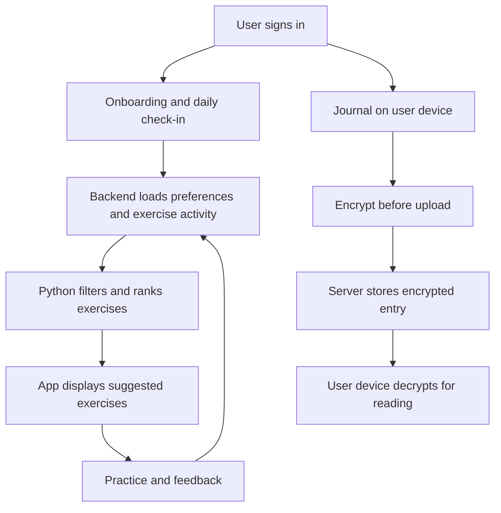

# How Holistic Mind works

Updated: 13 September 2026. This explains the current source code. The latest encryption work has been tested locally; it has not been deployed or applied to real users' existing journals.

## 1. The whole project in plain language

Holistic Mind helps someone check how they feel, find an exercise, practise it, and reflect in a private journal. It has four main parts:

| Part | What it does |
| --- | --- |
| Expo React Native app | Shows onboarding, check-ins, exercises, journaling, history, and the Library. Encrypts and decrypts journal content locally. |
| Node.js/Express backend | Checks login, reads and saves each account's data, serves content, and requests recommendations. |
| PostgreSQL database | Stores accounts, check-ins, exercise activity, content metadata, recommendation records, and encrypted journal entries. |
| Python recommendation service | Filters and ranks exercises using the information the backend supplies. |

A separate admin interface manages exercise and learning content. Media storage serves audio, video, and other uploaded assets.

The journal and recommendation paths are now separate: the backend does not read journal text to generate the app's recommendations.

## 2. Login, onboarding, and check-ins

The backend verifies the user's session before accessing personal data. Records are associated with that account's user ID. The app can refresh an expired access token and retry an authenticated request.

Onboarding collects a support goal, age range, and preferred daily time. The daily check-in collects six answers about the user's current state and support needs. Check-ins are stored by account and date; saving again for the same date updates that check-in.

The final check-in step also offers optional comfort choices:

| Avoid this | How recommendations respond |
| --- | --- |
| Self-touch | Exclude the butterfly hug and self-containment hold. |
| Breath holds | Exclude box breathing and published candidates marked as requiring breath holds. |
| Head or eye scanning | Exclude the orienting exercise. |
| Inward body scans | Exclude the body scan. |

These choices belong to that check-in; they are not permanent account-wide settings. The latest check-in supplies them to subsequent recommendation requests. Older check-ins without the field still work.

## 3. How an exercise becomes a recommendation

### Gather the inputs

The app requests recommendations after a check-in. The backend gathers the latest answers, comfort preferences, onboarding goal, published exercises, previous recommendation activity, and interaction/feedback information. It sends pseudonymous user IDs to Python, rather than names or email addresses. Pseudonymous IDs still link activity; they are not complete anonymisation.

**The app sends no journal text or journal embeddings to the recommender.**

### Remove excluded exercises first

Known contraindications, explicit comfort exclusions, and existing uncomfortable-feedback exclusions affect eligibility before final selection. Breath-hold exercises are also excluded under the engine's high-activation conditions. Category variety, rotation, or exploration must not reintroduce excluded exercises.

For example, someone can request grounding and choose to avoid self-touch. Even if a butterfly hug has a strong text match, it is removed before ranking. This uses the user's explicit choice; it does not infer their history or discomfort from a private journal.

### Score the eligible exercises

The engine combines suitability rules with similarity between the current context and exercise descriptions. When the MiniLM model is available, it converts those descriptions into numerical representations and compares their meaning. Production Python can fall back to lexical matching if model loading or inference fails.

| Score contribution | Without enough similar-user activity | With enough similar-user activity |
| --- | --- | --- |
| Suitability rules | 72% | 65% |
| Current-context text similarity | 23% | 20% |
| History-context similarity | 5% | 5% |
| Collaborative score from similar users | 0% | 10% |

“History-context” is the existing component name. The current app supplies an empty journal list, so this component can use the onboarding goal but not real journal content. The default collaborative threshold requires at least two qualifying neighbours, with at least two common interactions for similarity comparison.

These weights are ranking choices, not probabilities. A score of 0.8 does not mean an exercise has an 80% chance of helping someone.

### Choose and display the list

After scoring, the engine considers support alignment, category variety, and recent recommendations. It normally returns up to four exercises with reasons. It can return fewer—or none—when too few eligible exercises remain. The Home screen preserves an empty successful response rather than filling it with arbitrary exercises.

If the recommendation request fails, the app has a separate local fallback that also honours the shared comfort choices. This mobile fallback is a different algorithm from Python's lexical embedding fallback.

The backend records recommendation requests and displayed items. Later interactions and feedback can influence subsequent requests; this is not automatic neural-model retraining after every click.

## 4. How the encrypted journal works

### First use

1. Open **Journal → Open journal**.
2. The device generates a random encryption key.
3. Save the displayed `HMJ1.…` recovery key privately, then confirm its last eight characters.
4. The app enables the journal. The server stores an encrypted key-check value, not the secret key.

The recovery key contains the secret needed to decrypt entries. It must not be shared. Account login and journal decryption are separate: a password reset does not recover a missing journal key.

### Saving and reading

When someone saves a guided entry or free-writing entry, the app encrypts the pack, prompt/title, and body together using XChaCha20-Poly1305. It sends an entry ID, encryption version, public key ID, random nonce, and encrypted content. A nonce is a fresh random value used for that encryption operation; it is not the secret key.

The server stores that encrypted content and a timestamp. When the user reads it, their device downloads and decrypts it. The encryption binds each entry to its account and entry ID, and rejects tampered content or the wrong key.

The original words are preserved inside the encrypted content. They are **not replaced with embeddings**. Embeddings are useful for similarity matching, but they are not encrypted journal storage and do not reliably preserve the exact original entry.

### Devices, recovery, and locking

| Situation | What happens |
| --- | --- |
| Reopen on the same native device | After account login, the app can load its account-specific key from SecureStore. |
| Open on a new device | Enter the recovery key; the app verifies it before using it. |
| Use the browser | The key stays only in the unlocked in-memory session; reopening after a refresh requires recovery again. |
| Lock the journal | Removes the in-memory key and clears unsaved journal drafts. |
| Sign out | Clears the journal session; native SecureStore retains its key for that account. |
| Delete the account | Removes server journal/vault records through database cascades and attempts to remove this device's stored key. Other device copies are not remotely erased. |
| Lose all device keys and the recovery key | Encrypted entries cannot be recovered. |

There is currently no automatic background lock, extra biometric challenge, or key-rotation feature. The database still sees ownership, dates, counts, and ciphertext lengths. Check-ins and exercise feedback remain readable by the backend.

### Entries saved before encryption

An unlocked device offers **Encrypt older entries**. It downloads legacy entries, encrypts and verifies each one locally, then asks the server to replace the plaintext fields with encrypted content. It checks the returned entry too. The original ID and date are preserved, and an interrupted migration can resume.

Existing real journals have not been migrated during this development work. Old database backups also do not become encrypted merely because the live row is updated.

For implementation details and limits, read [Journal privacy](journal-privacy.md).

## 5. How the recommendation evaluation works

The benchmark asks: “How do these ranking approaches perform against our authored examples?” It is not a live measure of user wellbeing.

It uses 30 synthetic personas and 14 exercises. Each persona has a relevance label for every exercise: −1 means contraindicated according to the benchmark, 0 irrelevant, 1 weak match, 2 relevant, and 3 strongest match. Four approaches—random, text-only, rules, and hybrid—are compared. Default runs repeat each persona ten times per approach, with recorded random seeds.

| Metric | How to read it |
| --- | --- |
| Precision@4 | How many of four slots contain relevant exercises. Three relevant results out of four gives 0.75. |
| Recall@4 | How much of the persona's relevant exercise set was returned. |
| NDCG@4 | Whether the stronger matches appear nearer the top. Higher is better. |
| Hit rate | Whether at least one relevant result appears at the measured cutoff. |
| Label violations | How often a returned exercise has a negative label. Lower is better. |
| Fill rate | How many requested slots are filled; an empty list must not look successful just because it has no violations. |
| Diversity and coverage | Variety within lists and across the exercise catalogue. |
| Latency | Ranking time; it excludes model loading, networking, database work, and mobile rendering. |

A strong result should improve relevance and ordering while limiting violations. A high hit rate alone can hide unsuitable results elsewhere in the same list.

### Where the graphs are

- [Lexical benchmark dashboard](../recommender/evaluation/evaluation_results.html)
- [MiniLM/ONNX benchmark dashboard](../recommender/evaluation/evaluation_results_onnx.html)
- [Lexical charts, PNG](../recommender/evaluation/evaluation_results_charts.png)
- [MiniLM/ONNX charts, PNG](../recommender/evaluation/evaluation_results_onnx_charts.png)
- [Lexical charts, SVG](../recommender/evaluation/evaluation_results_charts.svg)
- [MiniLM/ONNX charts, SVG](../recommender/evaluation/evaluation_results_onnx_charts.svg)

Open either HTML file locally in a browser. Select a metric, filter the persona heatmap, click a cell, and inspect its ranked exercises and labels. Change the run to inspect its seed and results. Reports include JSON/CSV downloads and print-to-PDF support.

The saved reports use the original synthetic journal inputs and do not include the new comfort choices. They therefore do **not** measure the current app's journal-free input configuration. They also do not establish real-user benefit or clinical effectiveness. Comfort enforcement is tested separately; future evaluation should include the new input configuration and independently reviewed cases.

See [Benchmark methodology](RECOMMENDATION-BENCHMARK.md) for exact metrics and commands.

## 6. Code locations

| Area | Start here |
| --- | --- |
| Encryption and recovery orchestration | [JournalContext.tsx](../src/context/JournalContext.tsx) |
| Encryption primitives and content format | [journalCrypto.ts](../src/services/journal/journalCrypto.ts) |
| Setup, recovery, and migration controls | [JournalPrivacyGate.tsx](../src/components/journal/JournalPrivacyGate.tsx) |
| Encrypted journal API | [journal.ts](../backend/src/routes/journal.ts) |
| Recommendation inputs | [recommendations.ts](../backend/src/routes/recommendations.ts) |
| Shared comfort mapping | [comfortPreferences.ts](../backend/src/data/comfortPreferences.ts) |
| Python ranking | [engine.py](../recommender/app/engine.py) |
| Benchmark runner | [evaluate.py](../recommender/evaluation/evaluate.py) |

For what changed recently and what remains to release, read [Recent changes](RECENT-CHANGES.md).
