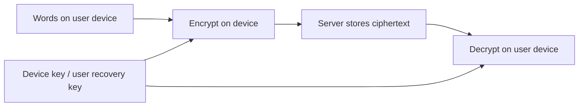

# Device-only journal encryption

Implemented in source; not deployed or run against existing user data. The owner
chose to keep journal decryption keys only on user devices. New journal titles,
prompt packs, prompts, and bodies are encrypted before upload. The backend stores
ciphertext and cannot decrypt it with any application or account-password secret.

## What happens when someone writes

1. Open Journal and choose **Open journal**. The first device generates a random
   256-bit key and a separate random key ID.
2. Save the displayed `HMJ1.…` recovery key somewhere private. Confirm its last
   eight characters before enabling encryption. The recovery key contains the
   actual secret; anyone with it and the encrypted entries can read those entries.
3. The app encrypts a JSON object containing pack, prompt/title, and exact text
   using XChaCha20-Poly1305 from `@noble/ciphers`. Each encryption uses a fresh
   random 24-byte nonce. Expo's asynchronous native randomness API is used, with
   no `Math.random` fallback.
4. The app sends only an entry ID and versioned envelope containing algorithm,
   public key ID, nonce, and authenticated ciphertext. The server assigns the date.
5. Reading reverses this on the device. Authentication binds the ciphertext to
   the account, entry ID, key ID, algorithm/version, and entry/vault purpose.
   Altered ciphertext or a different account/key/entry ID causes an error.

The database still sees ownership, timestamps, entry counts, key IDs, and
ciphertext lengths. Check-ins, onboarding answers, comfort preferences, and
exercise feedback retain their existing server-readable storage.

## Keys, recovery, and locking

Native devices keep the key in Expo SecureStore, scoped to the account, with
`WHEN_UNLOCKED_THIS_DEVICE_ONLY` accessibility. The SecureStore plugin is already
configured; rebuild the native client to include the new `expo-crypto` dependency.
Web keeps its key in memory for the unlocked session, never localStorage or cookies.
Use HTTPS for deployment.

An additional device imports the recovery key and verifies an encrypted known
value from the server before storing or using it. The server's vault record is
create-once; an account password reset does not replace it or recover journal
access. The code provides no key rotation or lost-key reset flow. A compromised
recovery key therefore requires a future rotation/migration feature.

**Lock journal** removes the in-memory key and unmounts the journal editors,
clearing their unsaved drafts. Sign-out/account changes also discard the journal
session. Native SecureStore retains its key across ordinary sign-out, so that
same device can reopen the journal after login. Account deletion attempts to
remove that device's key and cascades the server's vault and journal rows; it
cannot erase copies or recovery keys on other devices. The journal does not
currently request an extra biometric challenge or automatically lock when the
app is backgrounded. Use the device's screen lock and the explicit journal lock.

If all device copies and the recovery key are lost, **the encrypted history is
unrecoverable**. Logging in again alone is insufficient on a new device/browser.

## Existing entries

The schema change retains existing plaintext entries until the owner has an
unlocked key and has confirmed a recovery backup. Journal/History then show
**Encrypt older entries** with the number of remaining plaintext entries.

The client fetches legacy entries in batches of 100 via an authenticated,
`Cache-Control: no-store` endpoint. For each entry it encrypts all content fields,
decrypts locally to verify the result, then replaces the legacy fields with the
envelope in one conditional SQL update. After migration, `pack`, `prompt`, and
`content` are NULL. The original ID and timestamp remain. The client also checks
the returned ciphertext. Retries and concurrent device migrations return the
already encrypted entry without overwriting it. Interrupted migrations resume
with the remaining legacy entries. Invalid entries fail visibly and retain their
original text until the problem is resolved.

The normal GET endpoint returns encrypted entries only. Plaintext POST bodies
are rejected, so older app versions must update. Journal parser/database errors
are sanitized rather than logging bodies or legacy text. Deploy the schema and
backend together with the new app; do not roll back to an old plaintext client
or server after migration. No real journals were migrated during implementation.

Clearing a live row does **not** retroactively erase database backups, replicas,
transaction logs, previous exports, or earlier logs. Apply the deployment's
retention policy to these copies before claiming all previously stored text is
protected. External infrastructure must also avoid recording journal bodies.

## Recommendations and embeddings

The Node recommendation route no longer queries journal entries and always sends
`journal_texts: []`. It still uses check-ins, comfort preferences, the onboarding
support goal, exercise metadata, and interaction feedback. Python's existing
history similarity can still use the onboarding goal, but has no real journal
text from the app. No journal embeddings are generated on the device or uploaded.

Embeddings are not encryption or a reliable substitute for the original words.
They represent meaning, can expose sensitive information, and cannot reliably
reconstruct the exact entry for its owner. See the primary research
[Text Embeddings Reveal (Almost) As Much As Text](https://aclanthology.org/2023.emnlp-main.765/).
Future journal-aware personalization should run locally and needs its own model,
performance evaluation, and privacy design.

The saved synthetic benchmark reports still include their authored journal
inputs. They compare ranking strategies under those fixtures, not the new
journal-free production input path. Do not interpret their scores as measured
quality for the updated production configuration or as evidence of user benefit.

## Verification and limits

Run `npm run test:journal` (requires a localhost test listener), `npm run
test:comfort`, `npm run recommender:test`, `npx tsc --noEmit`, and `npm run api:build`.
Journal tests use ephemeral PostgreSQL through PGlite, the actual schema and
Express API, signed test tokens, and synthetic entries. They cover Unicode,
maximum-length payloads, wrong keys/account/entry binding, tampering, recovery,
plaintext rejection, create-once vaults, migration/retries, ownership, and deletion.
They never connect to the configured real database.

This implementation has not had an independent cryptographic/security review or
physical iOS/Android testing. Validate native key persistence, reinstall/recovery,
and updated app builds before release. The current App Store encryption declaration
must also be reviewed for this changed implementation before submission.
Encryption protects stored content from a database/server storage disclosure;
it does not protect an unlocked compromised device, screenshots, keyboards,
malicious client code, or guarantee secure erasure of JavaScript strings. A
compromised server that supplies modified web/client code can attack future key
use. Authenticated encryption detects content changes; it does not prevent the
server deleting or replaying valid records.

Implementation references: [noble-ciphers](https://github.com/paulmillr/noble-ciphers),
[Expo Crypto](https://docs.expo.dev/versions/v54.0.0/sdk/crypto/), and
[Expo SecureStore](https://docs.expo.dev/versions/v54.0.0/sdk/securestore/).
